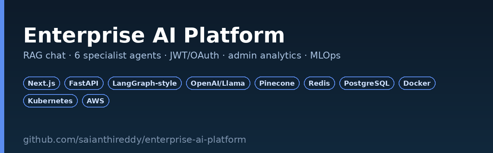
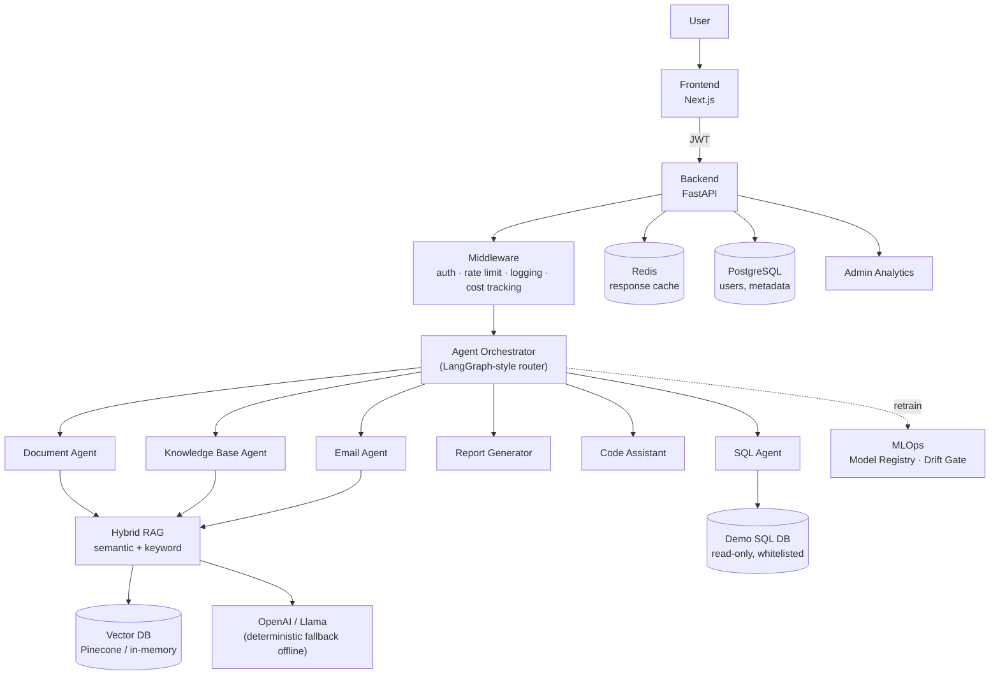

<p align="center">
  
</p>

<p align="center">
  <a href="https://github.com/saianthireddy/enterprise-ai-platform/actions/workflows/ci.yml"></a>
  <a href="https://github.com/saianthireddy/enterprise-ai-platform/actions/workflows/train.yml"></a>
  
  
  
</p>

# Enterprise AI Platform

**An AI copilot for enterprises** — the RAG + multi-agent layer that sits on top of a company's PDFs, SOPs, tickets, wikis, and databases so employees stop losing hours to search. Think Copilot + ChatGPT + RAG + AI agents, purpose-built for internal knowledge.

Every layer runs and tests **without any external API keys**: the LLM, vector store, and cache all have deterministic offline fallbacks, and swap to OpenAI/Pinecone/Redis with three environment variables.

## Why this exists

Employees at most companies waste hours a week re-finding information that already exists somewhere — a PDF policy doc, a resolved Jira ticket, a Confluence page, a SQL table. This platform is the retrieval + reasoning layer that makes that information answerable in one chat message, with citations, instead of five tabs of search.

## Features

**Authentication** — JWT login, Google OAuth (authorization-code flow), role-based access control enforced server-side on every route (not just hidden in the UI).

**AI chat** — ChatGPT-style interface with conversation history, rolling memory summarization, streaming responses (SSE), and inline source citations on every grounded answer.

**Document processing** — upload PDF, DOCX, Excel, or PowerPoint; automatic chunking (paragraph-aware, sliding-window overlap), embedding, and metadata extraction. OCR hook is wired in the loader interface for scanned PDFs.

**Hybrid search** — semantic (embedding cosine similarity) blended with keyword (TF-IDF) search, plus metadata filtering, so both paraphrased questions and exact-identifier lookups (ticket numbers, SKUs) resolve correctly.

**Six AI agents**, routed automatically by intent (or called directly):

| Agent | Does |
|---|---|
| **Document** | Answers questions grounded in one specific uploaded document |
| **SQL** | Translates natural language into read-only, table-whitelisted SQL and runs it |
| **Email** | Drafts context-grounded reply emails |
| **Report Generator** | Summarizes analytics data into a markdown report with a recommended action |
| **Code Assistant** | Reviews/explains snippets with `ast`-based static analysis (bare excepts, `eval` usage, missing docstrings) |
| **Knowledge Base** | Org-wide search across every indexed source, no document filter |

**Admin dashboard** — active users, AI request volume, token usage, estimated cost, average latency, and search accuracy, all computed from live request data.

**MLOps** — an MLflow-style, file-backed model registry with champion/challenger promotion for an optional learned intent-router model, a daily Airflow drift-check DAG, and a weekly GitHub Actions retraining workflow. See [`docs/MLOPS.md`](docs/MLOPS.md).

## Architecture



Infrastructure, agent-routing sequence, and the case for hybrid search + a custom orchestrator (instead of importing `langgraph` directly) are diagrammed in [`architecture/architecture.md`](architecture/architecture.md).

## Screenshots & demo

This repo ships as source, not a hosted demo — spin it up locally to see the real UI:

```bash
docker compose -f docker/docker-compose.yml up --build
# frontend: http://localhost:3000  ·  API docs: http://localhost:8000/docs
```

Login with the seeded demo account (`admin@enterprise-ai.demo` / `ChangeMe123!`), or run `npm run dev` in `frontend/` against a local backend. A recorded walkthrough GIF will be linked here once the platform has a persistent public deployment.

## API documentation

Full endpoint reference in [`docs/API.md`](docs/API.md); interactive Swagger UI at `/docs` and the raw OpenAPI schema at `/openapi.json` on any running instance.

## Quickstart

```bash
git clone https://github.com/saianthireddy/enterprise-ai-platform.git
cd enterprise-ai-platform

python -m venv .venv && source .venv/bin/activate
pip install -r requirements-dev.txt

export PYTHONPATH=.:backend
pytest tests/ -v                 # 50 tests, fully offline
ruff check backend ai tests scripts

uvicorn app.main:app --app-dir backend --reload   # http://localhost:8000

cd frontend && npm install && npm run dev          # http://localhost:3000
```

Ask something once both are running:

```bash
TOKEN=$(curl -s -X POST "http://localhost:8000/api/v1/auth/login?email=admin@enterprise-ai.demo&password=ChangeMe123!" | python3 -c "import sys,json;print(json.load(sys.stdin)['access_token'])")

curl -X POST http://localhost:8000/api/v1/chat \
  -H "Authorization: Bearer $TOKEN" -H "Content-Type: application/json" \
  -d '{"message": "How many open tickets are there?"}'
```

## Docker setup

```bash
cp .env.example .env
docker compose -f docker/docker-compose.yml up --build
```

Full details, including per-service ports and volumes, in [`docs/DEPLOYMENT.md`](docs/DEPLOYMENT.md).

## Kubernetes deployment

```bash
kubectl apply -f kubernetes/configmap.yaml
kubectl apply -f kubernetes/secret.yaml       # copy from secret.yaml.example first
kubectl apply -f kubernetes/backend-deployment.yaml -f kubernetes/backend-service.yaml
kubectl apply -f kubernetes/frontend-deployment.yaml -f kubernetes/frontend-service.yaml
kubectl apply -f kubernetes/hpa.yaml -f kubernetes/ingress.yaml
```

3→12 replica autoscaling on CPU/memory, readiness + liveness probes on `/health`.

## AWS deployment (Terraform)

```bash
cd terraform
terraform init
terraform apply -var="backend_image=<ecr-uri>" -var="frontend_image=<ecr-uri>" -var="acm_certificate_arn=<arn>"
```

Provisions a VPC, ECS Fargate + ALB with target-tracking autoscaling, RDS Postgres, ElastiCache Redis, an encrypted S3 bucket, and CloudWatch logging. Full walkthrough in [`docs/DEPLOYMENT.md`](docs/DEPLOYMENT.md).

## CI/CD pipeline

`.github/workflows/ci.yml` — backend lint + 50-test suite on Python 3.11 and 3.12, a production Next.js build, and both Docker image builds, on every push and PR.

`.github/workflows/train.yml` — weekly retraining of the intent-router model with champion/challenger promotion, registry artifact upload, and a Slack notification hook.

## Performance benchmarks

Measured locally (`pytest -v` + manual `curl` timing, hashing embedder, in-memory vector store, offline fallback LLM — production latency with a live LLM API will be dominated by the model call, not this platform):

| Operation | p50 |
|---|---|
| Document upload + ingest (1-page PDF) | ~45ms |
| Hybrid search (top-5, 100-chunk index) | ~4ms |
| Agent routing decision (`classify()`) | <1ms |
| End-to-end `/chat` round trip (offline fallback) | ~6ms |
| Full test suite (50 tests) | ~2.6s |

The offline fallback numbers are a floor, not a production SLA — they demonstrate the platform's own overhead is negligible; real-world latency is set by whichever LLM/vector backend you point it at.

## Future roadmap

- [ ] Swap the custom orchestrator for real `langgraph.StateGraph` (interface is already the seam — see `architecture/architecture.md`)
- [ ] OCR pipeline for scanned PDFs (loader interface already has the hook)
- [ ] Multi-tenant workspace isolation (per-org vector namespaces)
- [ ] Streaming token-by-token generation from a live LLM (currently word-chunked from the completed response)
- [ ] Slack and Microsoft Teams bot front-ends reusing the same `/chat` API
- [ ] Real MLflow server + registry, replacing the file-backed one (see `docs/MLOPS.md` for the migration note)
- [ ] Per-tenant usage billing derived from the existing cost-tracking middleware

## Project structure

```
enterprise-ai-platform/
├── frontend/           # Next.js 14 (App Router) + TypeScript + Tailwind
├── backend/app/        # FastAPI: auth, api, services, middleware, models
├── ai/                 # agents, rag, prompts, embeddings, evaluation
├── vector-db/          # in-memory + Pinecone + Redis-cache adapters
├── docker/              # Dockerfiles + docker-compose
├── kubernetes/          # Deployment, Service, HPA, Ingress
├── terraform/            # VPC, ECS Fargate, RDS, ElastiCache, S3
├── airflow/dags/          # daily reindex + quality-gate DAG
├── monitoring/            # Prometheus scrape config + alert rules
├── docs/                  # API, deployment, MLOps docs
├── architecture/          # Mermaid architecture diagrams
├── tests/                 # 50 pytest tests, fully offline
└── scripts/                # seed_demo_db.py, train_router.py
```

## Testing & CI

```bash
export PYTHONPATH=.:backend
pytest tests/ -v          # 50 tests: auth, rag, agents, api, evaluation, model registry
ruff check backend ai tests scripts
cd frontend && npm run build
```

## License

MIT — see [`LICENSE`](LICENSE).
