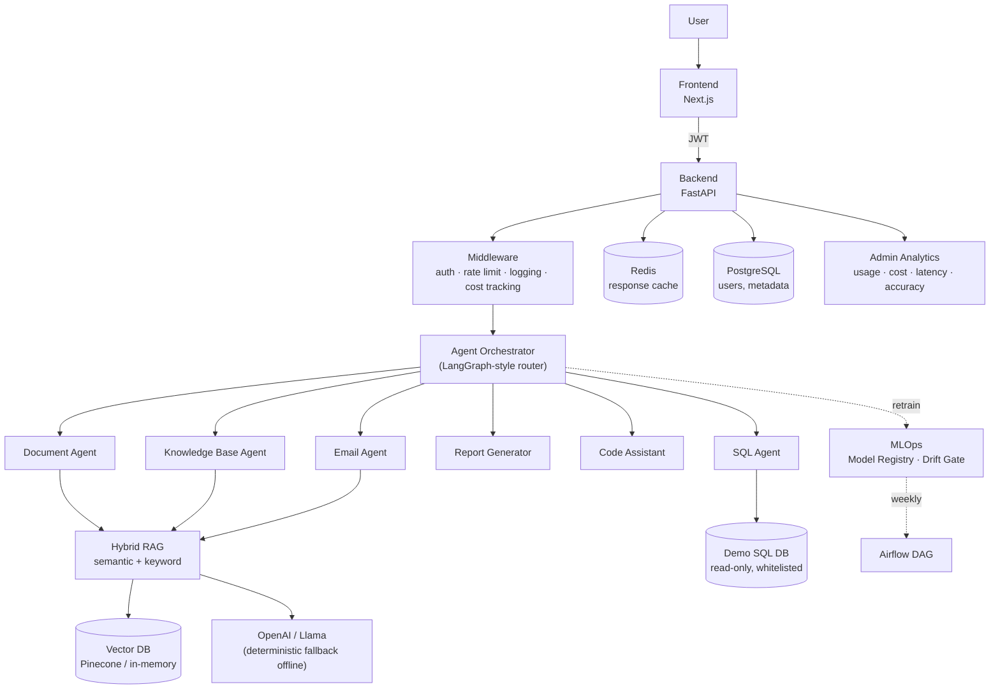
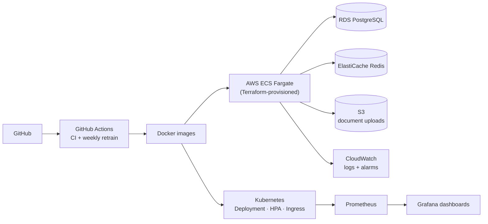
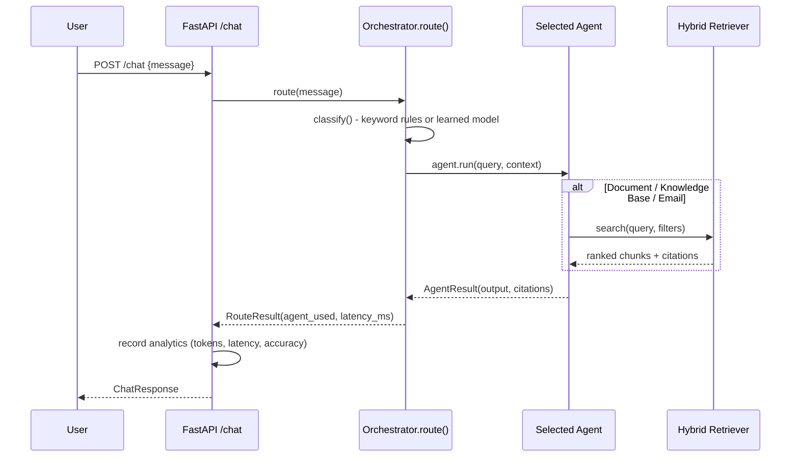

# Architecture

## System overview

## Infrastructure

## Agent routing flow

## Why hybrid search

Pure semantic search misses exact identifiers (ticket numbers, SKUs, error codes); pure keyword search misses paraphrases. `HybridRetriever` blends cosine similarity over embeddings with TF-IDF keyword scoring (default 60/40 weighting), which is why `document`/`knowledge_base` agent citations stay accurate even when a query mixes natural language with an exact term.

## Why a custom orchestrator instead of the `langgraph` package

The orchestrator is written as a small, dependency-free state graph (router node → 6 leaf agent nodes) rather than importing `langgraph` directly, so the entire platform — API, agents, and tests — runs offline with zero external services. The interface (`route()`, `classify()`) is the intended swap point: replacing it with `langgraph.StateGraph` is a contained change that doesn't touch any agent or API code.
